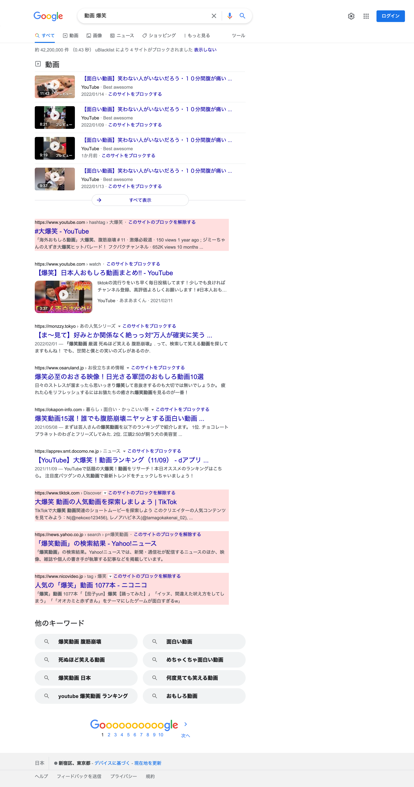

# ublacklist-search-result

SNSやショッピングサイトなどの検索結果ページを除外するための、uBlacklistのブラックリスト

## 使い方

1. [ublacklist](https://iorate.github.io/ublacklist/)をインストール
2. [ブラックリストを購読](
https://iorate.github.io/ublacklist/subscribe?name=ublacklist-search-result&url=https%3A%2F%2Fraw.githubusercontent.com%2Fmunierujp%2Fublacklist-search-result%2Fmaster%2Fblacklist.txt)

## なぜ？

- その情報について知りたいから検索しているのに、別のサイトの検索結果ページに飛ばされるようなたらい回し状態は望ましくない
- そのサイトの検索結果が見たければ、最初からそのサイトで検索する

## 方針

- `https://example.com/q=<検索ワード>`のようにURL内に検索ワードが含まれ、動的に生成されるようなページを対象とする
- 私が普段検索していて遭遇次第追加していく

## 例

