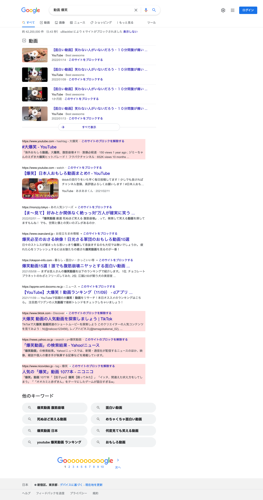

**English** | [日本語](README.ja.md)

# ublacklist-search-result

A uBlacklist blacklist for excluding SNS, shopping sites, and similar search result pages from search results

## Usage

Install [uBlacklist](https://iorate.github.io/ublacklist/) and [subscribe to the blacklist](
https://iorate.github.io/ublacklist/subscribe?name=ublacklist-search-result&url=https%3A%2F%2Fraw.githubusercontent.com%2Fmunierujp%2Fublacklist-search-result%2Fmaster%2Fblacklist.txt).\
If the link above does not work, please manually add the following URL:

```
https://raw.githubusercontent.com/munierujp/ublacklist-search-result/master/blacklist.txt
```

## Why?

- When you search because you want to learn about something, being redirected to another site’s search result page is an unnecessary extra step.
- If you want to see search results on a specific site, you can just search directly on that site.

## Policy

- Targets sites where search result pages are dynamically generated based on values in the URL, such as search keywords or tags, for example:
  - `https://example.com/search/?q=<search-term>`
  - `https://example.com/tag/<tag>`

## Example


